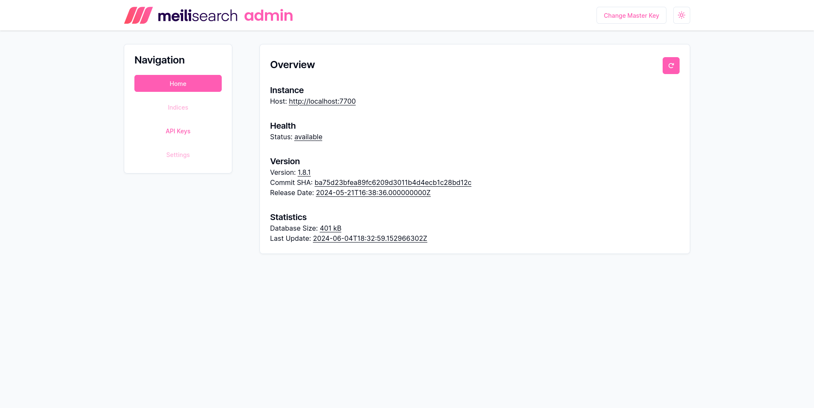
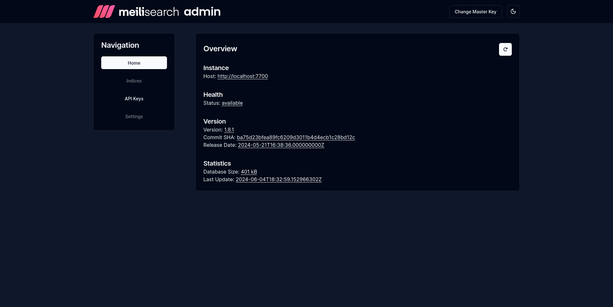

[](https://github.com/axelrindle/meiliadmin/actions/workflows/ci.yml)

# MeiliAdmin

> 🔎 Administrative web interface for MeiliSearch.

## Usage

```
$ docker run -d --name meili-admin -p 4173:8080 ghcr.io/axelrindle/meiliadmin
```

## Tech Stack

- MeiliSearch
- React
- shadcn/ui

## Screenshots




## License

[MIT](LICENSE)
